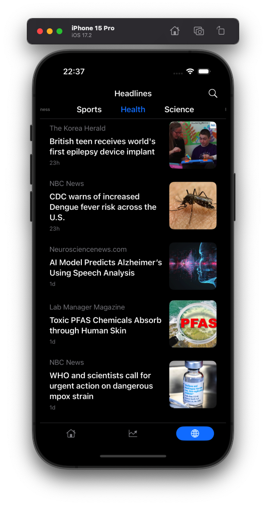

# News

News is an iOS application designed to provide users with access to news articles from multiple categories and sources. The app allows users to customize their news feed by selecting preferred categories, view trending and top articles, and search for specific news stories, all within an intuitive and user-friendly interface.

## Screenshots

